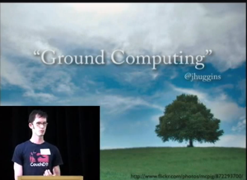

## About the Ground Computing
Ground  Computing is a general term for a network architecture similar to Cloud  Computing but where the Web Servers delivering content are in the  presence of the actual users requesting data from the Web Servers.  The  term "ground computing" was originally coined by Jason Huggins (@hugs)  in a tweet.

> "I think they should call offline-mode in couchdb "ground computing" (opp. of "cloud computing") #jsconf"

The term was later adopted and popularized by CouchDB committer Chris Anderson at his Google Tech Talk "CouchDB: Relaxing Offline JavaScript"

## Get involved!
- Join the [Ground Computing email list on Google Groups](https://groups.google.com/forum/#!overview)
- [The Ground Computing Wiki](https://groundcomputing.hackpad.com/)

## Ground Computing Projects for Libraries
- [BeLL Server](http://bellserver.github.io)
- [KA Lite](https://learningequality.org/ka-lite/)
- [LibraryBox](http://jasongriffey.net/librarybox/)
- [Little Library](http://www.thelittlelibrary.com/)

## Ground Computing Projects for Environmental Monitoring
- [Fido Temperature Alarm](http://fidoserver.github.io)
- [Hive Sensor Server](http://github.com/apitronics/hive)

